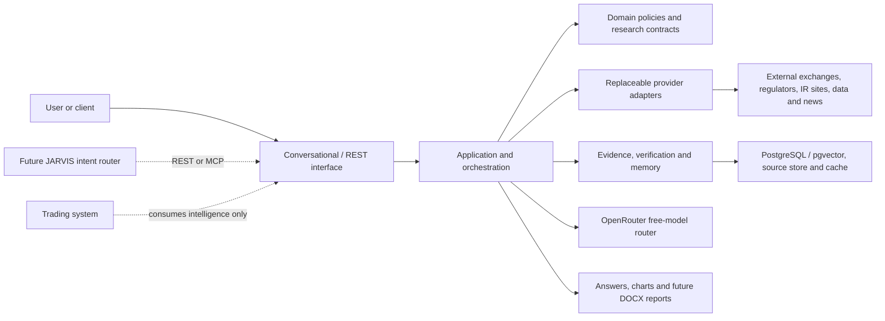
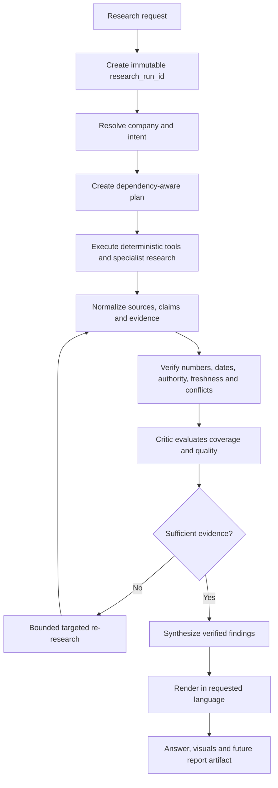

# Architecture

## Status and scope

This document defines the frozen **target architecture** and its layer boundaries. Phases 0–10 have implemented an accepted subset that includes deterministic company and specialist intelligence foundations, bounded planning/workflows, verification/synthesis/reporting, REST `/v1` aliases, a selected in-process MCP facade, and local production-hardening evidence. The conceptual diagram still contains deferred target-state components; no box should be interpreted as implemented unless `PROJECT_STATUS.md` and the implemented-versus-deferred documentation say so.

The supplied conceptual diagram is preserved at [docs/architecture/agentic-financial-intelligence-platform.png](docs/architecture/agentic-financial-intelligence-platform.png). The image and this document together are the **Master Architecture**. Written decisions and explicit phase gates take precedence where visual shorthand is ambiguous. Once Phase 0 Prompt 3 is approved, changes to the Master Architecture require owner approval and a new or superseding ADR.

This is a new standalone financial-intelligence platform. It is not the previous Financial Research Agent, ToolBridge, JARVIS, a trading bot/system, a generic stock or RAG chatbot, or a single-prompt report generator. JARVIS and trading systems are future external consumers only.

## Architectural drivers

- verifiable, time-aware equity research rather than generic chat;
- source authority and preserved provenance;
- zero-cost development using configurable free-model routes;
- deterministic computation where software is more reliable than an LLM;
- resilient operation despite provider limits and outages;
- multilingual presentation without altering normalized facts;
- independent deployment and future REST/MCP integration;
- full research-run observability and auditability.

## Context and trust boundaries



External sources, downloaded documents, web content, model output, and integration clients cross trust boundaries. They require validation, size/time limits, sanitization, and auditable failure handling.

## Layered responsibilities

### Interface layer

Future FastAPI, Streamlit, and MCP adapters translate external requests into application commands and responses. They handle authentication/authorization when introduced, transport validation, and presentation concerns. They do not contain research policy.

### Application layer

Coordinates use cases, transactions, research-run lifecycle, idempotency, and calls to domain ports. It owns workflows but delegates factual rules and calculations to domain services.

### Domain layer

Defines provider-neutral concepts such as company identity, market/exchange, research request, plan, task, claim, evidence, source, contradiction, verification, confidence, and research-run state. It must remain importable without framework or infrastructure packages.

### Orchestration and agent capabilities

The target LangGraph-based orchestration layer contains:

1. Intent Engine
2. Company Resolver
3. Research Planner
4. Task Orchestrator
5. Execution Monitor

Planned specialist capabilities cover market, financial, filing, news/events, industry/competitor, regulatory, risk, and sentiment research. They operate through typed tools and provider ports, may run concurrently where dependencies allow, and return structured results and evidence references. None are implemented in Phase 0.

### Infrastructure and provider adapters

Adapters will encapsulate HTTP providers, parsing, persistence, queues/caches, OpenRouter, and artifact storage. A provider can be disabled or replaced without changing domain contracts. Provider-specific rate limits, licensing, credentials, and freshness behavior remain local to the adapter/configuration.

## Dependency direction and communication rules

The approved design is a clean modular architecture using ports and adapters. “Interface” has two distinct meanings: an **application port** is an inward-facing contract owned by application/domain policy; a **delivery interface** is an outer REST, Streamlit, CLI, or future MCP adapter.

```text
delivery interfaces / composition root
                 -> application use cases and orchestration
                 -> domain policies and value objects

infrastructure/provider adapters
                 -> implement application/domain ports
```

Allowed dependencies are:

- **Domain** may depend only on Python/platform-neutral domain modules. It must not import FastAPI, OpenRouter, LangGraph, PostgreSQL/pgvector, Redis, Streamlit, MCP, provider SDKs, or SEC/NSE/BSE HTTP implementations.
- **Application** may depend on domain contracts and the ports it owns. It coordinates use cases, Research Runs, transactions, and policy; it does not construct concrete providers.
- **Orchestration** is an application capability. It may depend on application/domain contracts and typed capability/tool ports, but not on concrete HTTP, persistence, model, or delivery adapters.
- **Infrastructure/providers** implement ports and may depend on external libraries. They translate vendor data/errors into canonical contracts and cannot redefine domain truth rules.
- **Delivery interfaces** validate transport input, call application use cases, and map results/errors. FastAPI, Streamlit, and MCP never call providers or databases directly.
- **Composition root** is the only location allowed to select and wire concrete adapters. Cross-module communication uses typed calls/contracts or explicit events; modules do not reach into another module's storage.

Provider replacement must not require rewriting domain logic. Any exception to these dependency rules requires an ADR and owner approval.

## Intelligent capability boundaries

An “agent” is reserved for a bounded reasoning responsibility with a clear contract. Not every capability is an LLM agent, and orchestration must not create an agent for each function.

| Capability | Conceptual input | Required structured output |
|---|---|---|
| Research Planner | Research Request, normalized intent, available capability descriptors, budgets | Research Plan and dependency-ordered Research Tasks |
| Market Intelligence | Company Identity, market-data task, as-of/freshness constraints | Market observations/calculations plus Source and Evidence references |
| Financial Intelligence | Company Identity, periods, normalized filing/financial facts | Statements, ratios/trends, calculation lineage, claims and evidence references |
| Filing Intelligence | Company Identity, filing task and source constraints | Filing metadata, governed extracts, claims and evidence references |
| News & Event Intelligence | Company Identity, time window, event scope | Deduplicated events, dates, source authority, claims and evidence references |
| Industry & Competitor Intelligence | Company Identity, comparison scope, evidence constraints | Comparable entities, benchmarks, findings and evidence references |
| Regulatory Intelligence | Company/industry/jurisdiction context | Applicable developments, effective dates, impact interpretations and evidence references |
| Risk Intelligence | Verified claims/findings and requested risk scope | Evidence-linked risk statements, category, severity rationale and uncertainty |
| Verification / Critic | Claims, Evidence, Sources, coverage and run budgets | Verification Results, contradictions, Critic Assessment, optional bounded re-research requests |
| Synthesis | Verified Findings, unresolved conflicts, requested audience/language | Research Synthesis with citations, qualifications and quality/confidence context |

Deterministic services perform calculations, ticker normalization, schema/date/number validation, document parsing, chart generation, caching, persistence, source metadata, and report formatting. Sentiment is a bounded analysis capability using cited evidence; it need not be a standalone autonomous agent.

## Target research-run lifecycle



### Canonical execution contract

| Concept | Responsibility |
|---|---|
| Research Request | Preserve the original user/client request, requested companies, language, scope and explicit constraints. |
| Research Run | Root lifecycle/audit context with unique identity, budgets, timestamps, state and terminal outcome. |
| Company Resolution | Map ambiguous names/tickers to one or more canonical Company Identities or return explicit ambiguity. |
| Research Plan | Versioned goal, selected capabilities, task dependencies, coverage and execution budgets. |
| Research Task | Small traceable work unit with typed input/output, dependencies, attempts, deadline and status. |
| Tool/Agent Execution | Audited deterministic or reasoning execution that returns structured output/errors—not anonymous prose. |
| Source Document | Acquired authoritative/reference content plus source, publication, retrieval, integrity and storage metadata. |
| Evidence | Reproducible excerpt, fact, observation or derived calculation supporting/refuting a Claim. |
| Verification Result | Immutable outcome of a named/versioned source, number, date, freshness, conflict or coverage check. |
| Critic Assessment | Sufficiency and quality review that identifies unsupported, missing, stale, conflicting or overconfident material. |
| Re-research Task | Targeted bounded task created only for a documented evidence gap or conflict. |
| Research Finding | Evidence-linked, verification-aware result; clearly separates fact from interpretation. |
| Research Synthesis | User-facing integration of verified Findings and visible uncertainty/conflicts. |
| Report Artifact / Chat Response | Presentation output derived from the Synthesis and linked to its Research Run. |

Each transition must accept and return typed/versioned contracts, preserve failures rather than silently dropping them, and remain idempotent where retries could duplicate external effects.

### Research Run ID contract

The canonical `research_run_id` will be a UUIDv4 represented in standard lowercase UUID text form at API/document boundaries and a native UUID type where supported. UUIDv4 is globally unique, opaque, supported directly by Python 3.12 and PostgreSQL, and does not reveal local sequence or timing. Ordering uses explicit `created_at`; a human-friendly `RES-...` display label may be derived but is never the primary key. Implementing the generator belongs to Phase 1.

Every original request, canonical company, plan, task, tool/agent/model call, source, evidence item, claim, verification result, contradiction, retry, latency/token/cache metric, error, finding, synthesis and artifact must link directly or transitively to the Research Run. Correlation must survive concurrency and asynchronous execution.

### Company Identity contract

`Company Identity` is provider-neutral and distinguishes issuer, listing and security. Its conceptual fields include `canonical_company_id`, legal/display names, ticker, exchange, country, trading/reporting currency, ISIN when available, sector, industry, validity dates, share class/security type and provider aliases.

Ticker alone is never a global identity. Resolution must handle the same ticker on different exchanges, ADRs versus primary listings, multiple share classes, renamed/delisted companies, provider ticker syntax, NSE/BSE cross-listings and U.S. exchange changes. Aliases retain provider and validity context; company resolution returns ambiguity instead of guessing. Final persistence and identifier schemas belong to Phase 2.

## Evidence and knowledge architecture

- **Source store:** immutable or content-addressed raw documents plus retrieval metadata and integrity hash.
- **Evidence graph:** claims, supporting/refuting evidence, sources, relationships, periods, and contradiction state.
- **PostgreSQL:** canonical transactional metadata and research state.
- **pgvector:** embeddings associated with governed chunks; it complements rather than replaces source records.
- **Hybrid retrieval:** keyword/filter search plus vector similarity, with tenant/session and authority constraints.
- **Research memory:** prior runs, company history, comparisons, user sessions, and preference references.
- **Redis:** bounded cache and transient coordination only; never the sole durable evidence store.

Detailed concepts are in `EVIDENCE_MODEL.md`.

## Verification and reflection

Verification is a deterministic-first pipeline for source identity, units, dates, periods, arithmetic, freshness, and cross-source comparison. Model-assisted reasoning may help interpret conflicts but cannot silently resolve them. Confidence is computed from transparent factors and is not a model's self-reported certainty.

The critic identifies unsupported conclusions, missing/stale evidence, contradictions, coverage gaps and overconfident synthesis. It may request targeted re-research only for a recorded gap or conflict.

Every run must carry configuration-bounded maximum reflection iterations, re-research task count, wall-clock deadline, provider/model attempts, and token/context budget. Stop conditions include sufficient evidence, exhausted budget/deadline/attempts, cancellation, non-retryable failure, or no material quality improvement. Exhaustion produces a transparent incomplete result rather than an invented conclusion. Exact defaults are owned by Phase 6/8 evaluations.

## Free-model routing

All model calls go through one application port and policy-enforcing router. Configuration supplies a primary free model and bounded free fallbacks. The router validates the allow-paid flag, captures latency/token/failure metadata, uses bounded retries, and fails closed before any paid route. See `MODEL_POLICY.md`.

## Free-first and token-efficiency contract

Large documents must not be sent wholesale to a model by default. The target path is:

```text
download -> validate -> parse -> normalize -> deduplicate -> chunk/index
         -> retrieve relevant evidence -> budget context -> reason
```

Acquisition, parsing, calculations, validation and retrieval run before generation. Cache keys include source/model/prompt/policy versions and freshness; deduplication occurs before model use. Context and output tokens, model calls, concurrency and retries are bounded. A model call requires a reasoning need that deterministic software cannot reliably satisfy. RAG/retrieval implementation remains Phase 7 work.

## Multilingual separation

```text
source research -> normalized verified evidence -> synthesis -> language rendering -> user
```

English and Telugu are the initial presentation targets; Hindi and other languages may be added later. Legal/display company identity, ticker, exchange, quantities, currencies, dates/reporting periods, source references, verification state and confidence meaning remain canonically unchanged across languages. Translation may alter prose but never factual values or evidence links.

## Report boundary

Future report generation consumes a versioned report model; it does not query providers directly. DOCX rendering, charts, citation formatting, and filename sanitization belong to reporting adapters. Report artifacts retain research-run linkage and generation metadata. The frozen section/classification contract is documented in [docs/reports/README.md](docs/reports/README.md).

## Integration boundaries

- FastAPI REST is the initial programmatic interface planned for Phase 1 and later expanded by phase.
- MCP is a future interoperability adapter over approved application capabilities; it is not core architecture. Conceptual later tool names may include `resolve_company`, `research_company`, `get_market_data`, `get_financials`, `get_filings`, `get_company_news`, `analyze_risk`, `compare_companies`, `ask_research_question` and `generate_research_report`. These names grant no Phase 0 implementation scope.
- JARVIS may call the service but is not required to run it.
- Trading is a separate bounded system. This platform may research companies/markets, identify risks, generate structured intelligence, and provide that intelligence to JARVIS. It must never place broker/MT5 orders, modify positions, manage trading credentials, or bypass trading-system risk controls.

```text
Financial Research Platform -> Structured Intelligence -> JARVIS / Integration Layer
                            -> Separate Trading System -> Trading Risk Controls -> Execution
```

Only the separate trading system can own execution.

## Target runtime topology

The initial deployment target is a modular monolith: API/application workers, PostgreSQL with pgvector, Redis, and artifact storage, packaged with Docker Compose for development. This avoids premature microservices while retaining ports that permit later separation. Streamlit remains a client of application/REST contracts.

## Observability

Structured, secret-safe telemetry will include `research_run_id`, start/end/duration, plan/task state, task/success/failure counts, tool/model calls, retry counts, input/output tokens, estimated cost, cache hits/misses, evidence/verified-claim/contradiction/source counts, errors and report status. Model telemetry includes configured model, agent/task, latency, status and cached/not-cached state. Under the free-only policy estimated model cost must remain zero; a non-zero estimate is a policy incident.

User-visible transparency may expose the plan, task states, tools/sources used, evidence summaries, verification results, confidence and latency. It must never expose private chain-of-thought, hidden scratch reasoning, secrets, or unnecessarily reproduce proprietary/raw content.

## Canonical terminology

- **Research Planner:** creates the Research Plan; it is not called manager or supervisor.
- **Task Orchestrator:** routes and coordinates Research Tasks; it does not redefine evidence.
- **Research Run / Research Task:** root execution context and its bounded work units.
- **Source / Evidence / Claim:** acquired origin, reproducible support/refutation and normalized assertion.
- **Verification / Critic Assessment:** checks and sufficiency/quality review.
- **Finding / Synthesis / Report Artifact:** verified result, integrated presentation model and rendered output.

## Deferred decisions

Phase 0 intentionally does not fix the persistence schema, graph representation, background execution mechanism, artifact storage provider, exact free-model IDs, embedding model, chunking strategy, auth model, or deployment cloud. UUIDv4 is frozen for `research_run_id`, but its domain type/generator placement is a Phase 1 implementation decision. Each remaining choice requires investigation and an ADR in the owning phase.
